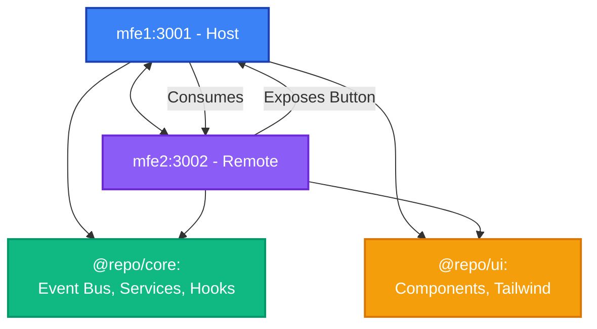

# Micro Frontend Skeleton

A modular micro-frontend architecture demonstrating Module Federation with React applications in a **pnpm monorepo** structure.

## 🏗️ Architecture Overview

This monorepo contains two micro-frontend applications with shared packages:

### Applications

- **mfe1 (@repo/mfe1)** - Host application running on port 3001
- **mfe2 (@repo/mfe2)** - Remote application running on port 3002

### Shared Packages

- **@repo/core** - Shared business logic (Event Bus, hooks, services)
- **@repo/ui** - Shared UI components and Tailwind configuration

### Communication Pattern



## 📁 Monorepo Structure

```
micro-fe-skeleton/
├── package.json              # Root workspace configuration
├── pnpm-workspace.yaml       # Workspace definitions
├── .npmrc                    # pnpm settings for Module Federation
├── tsconfig.base.json        # Shared TypeScript configuration
├── apps/
│   ├── mfe1/                 # Host application (@repo/mfe1)
│   │   ├── src/
│   │   ├── rsbuild.config.ts
│   │   ├── tsconfig.json
│   │   └── package.json
│   └── mfe2/                 # Remote application (@repo/mfe2)
│       ├── src/
│       ├── rsbuild.config.ts
│       ├── tsconfig.json
│       └── package.json
└── packages/
    ├── core/                 # @repo/core - Shared business logic
    │   ├── src/
    │   │   ├── event-bus/    # Type-safe Event Bus
    │   │   ├── hooks/        # useNotificationStore
    │   │   ├── services/     # NotificationService
    │   │   └── types/        # Shared TypeScript types
    │   ├── tsconfig.json
    │   └── package.json
    └── ui/                   # @repo/ui - Shared UI components
        ├── src/
        │   ├── components/   # 13 Radix UI components
        │   ├── hooks/        # useIsMobile
        │   └── lib/          # cn() utility
        ├── tailwind.config.ts
        ├── tsconfig.json
        └── package.json
```

## 📚 Tech Stack

### Core Technologies

| Technology            | Version | Purpose                         |
| --------------------- | ------- | ------------------------------- |
| **React**             | 18.3.1  | UI library                      |
| **TypeScript**        | 5.9.3   | Type-safe JavaScript            |
| **pnpm**              | 9.15.0  | Fast, efficient package manager |
| **Rsbuild**           | ~1.6.x  | Fast Rust-based build tool      |
| **Module Federation** | 0.21.6  | Micro-frontend orchestration    |

### Shared Packages (@repo/core)

| Technology  | Version | Purpose            |
| ----------- | ------- | ------------------ |
| **Zustand** | 5.0.9   | Notification store |
| **React**   | 18.3.1  | Peer dependency    |

### Shared Packages (@repo/ui)

| Technology         | Version  | Purpose                  |
| ------------------ | -------- | ------------------------ |
| **Radix UI**       | Various  | Accessible UI primitives |
| **CVA**            | 0.7.1    | Component variants       |
| **clsx**           | 2.1.1    | Conditional classNames   |
| **Lucide React**   | 0.555.0  | Icon library             |
| **Motion**         | 12.23.25 | Animation library        |
| **Tailwind Merge** | 3.4.0    | Tailwind class merging   |
| **TailwindCSS**    | 3.4.14   | Utility-first CSS (peer) |

### MFE1 (Host) - Additional Dependencies

| Technology       | Version | Purpose                     |
| ---------------- | ------- | --------------------------- |
| **React Router** | 6.30.2  | Client-side routing         |
| **Zustand**      | 5.0.9   | State management            |
| **TailwindCSS**  | 4.1.17  | Utility-first CSS framework |
| **next-themes**  | 0.4.6   | Theme management            |
| **Immer**        | 11.0.1  | Immutable state updates     |

### MFE2 (Remote) - Additional Dependencies

| Technology       | Version | Purpose             |
| ---------------- | ------- | ------------------- |
| **React Router** | 6.30.2  | Client-side routing |

### Build & Development Tools

- **@rsbuild/plugin-react** - React support for Rsbuild
- **@module-federation/rsbuild-plugin** - Module Federation integration
- **@module-federation/bridge-react** - React bridge for Module Federation
- **@module-federation/enhanced** - Enhanced Module Federation features
- **@module-federation/runtime** - Runtime for Module Federation

### Code Quality

- **ESLint** - Code linting
- **Prettier** - Code formatting
- **TypeScript ESLint** - TypeScript linting rules

## 🚀 Getting Started

### Prerequisites

- **Node.js** 18.x or higher
- **pnpm** 9.x or higher

If you don't have pnpm installed:

```bash
npm install -g pnpm
```

### Installation

Clone the repository and install all dependencies from the root:

```bash
# Install all workspace dependencies
pnpm install
```

This single command will install dependencies for:

- Root workspace
- Both apps (mfe1, mfe2)
- Both shared packages (@repo/core, @repo/ui)

### Environment Configuration

Both applications use environment variables to configure remote endpoints.

**For mfe1:**
Create a `.env.local` file in the `apps/mfe1` directory (optional, defaults are configured):

```env
VITE_MFE2_BASE_URL=http://localhost:3002
VITE_MFE2_SCOPE=remote
```

**For mfe2:**
Create a `.env.local` file in the `apps/mfe2` directory (optional, defaults are configured):

```env
VITE_MFE1_BASE_URL=http://localhost:3001
VITE_MFE1_SCOPE=host
```

### Running the Applications

> **Important:** You must run **mfe2 first**, then mfe1, because mfe1 (host) depends on mfe2 (remote).

#### Option 1: Run Individually

**Step 1 - Start mfe2 (Remote) from root:**

```bash
pnpm --filter @repo/mfe2 dev
```

This will start mfe2 on `http://localhost:3002`

**Step 2 - Start mfe1 (Host) in a new terminal:**

```bash
pnpm --filter @repo/mfe1 dev
```

This will start mfe1 on `http://localhost:3001` and automatically open in your browser.

#### Option 2: Run Both in Parallel

```bash
pnpm dev
```

This runs both applications concurrently.

#### Option 3: Use Helper Scripts

From the root directory:

```bash
# Start mfe1 only
pnpm dev:mfe1

# Start mfe2 only
pnpm dev:mfe2
```

### Accessing the Applications

- **mfe1 (Host):** http://localhost:3001
- **mfe2 (Remote):** http://localhost:3002

## 📦 Module Federation Configuration

### mfe1 (Host) Configuration

- **Name:** `host`
- **Port:** 3001
- **Exposes:**
  - `./NotFound` - 404 Not Found component
- **Consumes:**
  - Remote components from mfe2

### mfe2 (Remote) Configuration

- **Name:** `remote`
- **Port:** 3002
- **Exposes:**
  - `./Button` - Exportable Button component
- **Consumes:**
  - Host components from mfe1

## 🛠️ Available Scripts

### Root Workspace Commands

| Script           | Command               | Description                              |
| ---------------- | --------------------- | ---------------------------------------- |
| `dev`            | `pnpm dev`            | Run all apps in parallel                 |
| `dev:mfe1`       | `pnpm dev:mfe1`       | Run mfe1 only                            |
| `dev:mfe2`       | `pnpm dev:mfe2`       | Run mfe2 only                            |
| `build`          | `pnpm build`          | Build all apps                           |
| `build:mfe1`     | `pnpm build:mfe1`     | Build mfe1 only                          |
| `build:mfe2`     | `pnpm build:mfe2`     | Build mfe2 only                          |
| `build:packages` | `pnpm build:packages` | Build all shared packages                |
| `typecheck`      | `pnpm typecheck`      | Type-check all workspaces                |
| `format`         | `pnpm format`         | Format all code with Prettier            |
| `format:check`   | `pnpm format:check`   | Check code formatting                    |
| `clean`          | `pnpm clean`          | Remove all node_modules and dist folders |

### Individual App Commands

Run commands for specific apps using the filter flag:

```bash
# Build specific app
pnpm --filter @repo/mfe1 build

# Type check specific app
pnpm --filter @repo/mfe2 typecheck

# Run any package.json script
pnpm --filter <package-name> <script-name>
```

## 🔧 Development Tips

### Hot Module Replacement (HMR)

Both applications support HMR out of the box. Changes to source files (including shared packages) will automatically reload in the browser.

### Workspace Dependencies

The monorepo uses `workspace:*` protocol for local package dependencies:

```json
{
  "dependencies": {
    "@repo/core": "workspace:*",
    "@repo/ui": "workspace:*"
  }
}
```

This ensures apps always use the latest local version of shared packages.

### Shared Dependencies

React and React-DOM are configured as singletons to ensure only one instance is loaded across all micro-frontends:

```javascript
shared: {
  react: {
    singleton: true,
    requiredVersion: false,
  },
  'react-dom': {
    singleton: true,
    requiredVersion: false,
  },
}
```

### Path Aliases

TypeScript is configured with path aliases for cleaner imports:

**In apps (mfe1, mfe2):**

- `@/*` → `./src/*`
- `@repo/core` → `../../packages/core/src`
- `@repo/ui` → `../../packages/ui/src`

**In mfe2 specifically:**

- `host/*` → `./src/types/host.d.ts` for host type definitions

### Import Examples

```typescript
// Import from shared core package
import { publishEvent, subscribeEvent } from "@repo/core/event-bus";
import { notificationService } from "@repo/core/services";
import { useNotificationStore } from "@repo/core/hooks";

// Import from shared UI package
import { Button } from "@repo/ui/components/button";
import { Card } from "@repo/ui/components/card";
import { cn } from "@repo/ui/lib/utils";
```

## 📦 Shared Packages

### @repo/core

**Event Bus** - Type-safe event system for cross-app communication

```typescript
import {
  publishEvent,
  subscribeEvent,
  AppEventMap,
} from "@repo/core/event-bus";

// Publish an event
publishEvent("notification:show", {
  type: "success",
  title: "Success!",
  message: "Operation completed",
});

// Subscribe to events
const unsubscribe = subscribeEvent("notification:show", (detail) => {
  console.log(detail);
});
```

**Services**

- `NotificationService` - Centralized notification management with methods like `success()`, `error()`, `warning()`, `info()`

**Hooks**

- `useNotificationStore` - Zustand store for managing notification state

**Types**

- `NotificationPayload`, `ThemePayload`, `ModalPayload` - Shared TypeScript interfaces

### @repo/ui

**Components** (13 total)

- `avatar`, `button`, `card`, `collapsible`, `dropdown-menu`
- `input`, `loader`, `scroll-area`, `separator`, `sheet`
- `sidebar`, `skeleton`, `tooltip`

All components are built with Radix UI primitives and styled with Tailwind CSS.

**Utilities**

- `cn()` - Merge Tailwind classes intelligently

**Hooks**

- `useIsMobile` - Responsive breakpoint detection

**Configuration**

- `tailwind.config.ts` - Shared design tokens and theme configuration

## 🐛 Troubleshooting

### Issue: mfe1 can't load remote components

**Solution:** Ensure mfe2 is running before starting mfe1. The host needs the remote to be available.

### Issue: Module Federation errors

**Solution:**

1. Clear all `node_modules` and `dist` folders: `pnpm clean`
2. Reinstall dependencies: `pnpm install`
3. Restart both development servers

### Issue: Changes in shared packages not reflecting

**Solution:**
The workspace dependencies are linked automatically. If changes aren't reflecting:

1. Restart the dev server
2. Check that you're importing from the correct package (`@repo/core` or `@repo/ui`)
3. Verify path aliases in tsconfig.json

### Issue: Type errors with workspace packages

**Solution:**

1. Check that path aliases in `tsconfig.json` are correctly configured
2. Run `pnpm install` to ensure workspace links are created
3. Restart your IDE/TypeScript server

### Issue: pnpm workspace not found

**Solution:**
Make sure you have `pnpm-workspace.yaml` in the root directory with:

```yaml
packages:
  - "apps/*"
  - "packages/*"
```

## 📝 Additional Resources

- [Module Federation Documentation](https://module-federation.io/)
- [Rsbuild Documentation](https://rsbuild.dev/)
- [React Documentation](https://react.dev/)
- [TailwindCSS Documentation](https://tailwindcss.com/)
- [pnpm Workspaces](https://pnpm.io/workspaces)

## 📄 License

This is a skeleton project for demonstration purposes.

---

**Happy Coding! 🚀**
