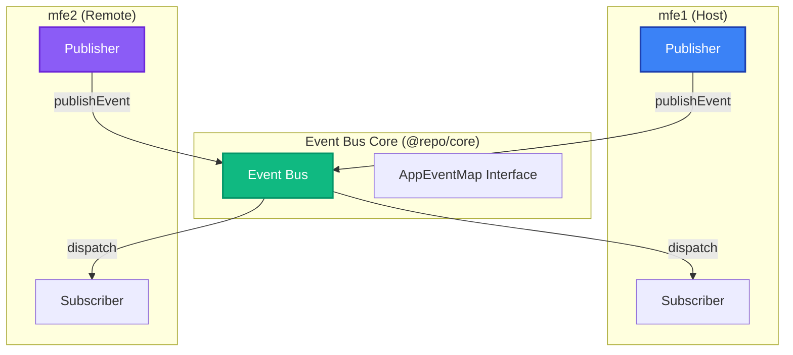
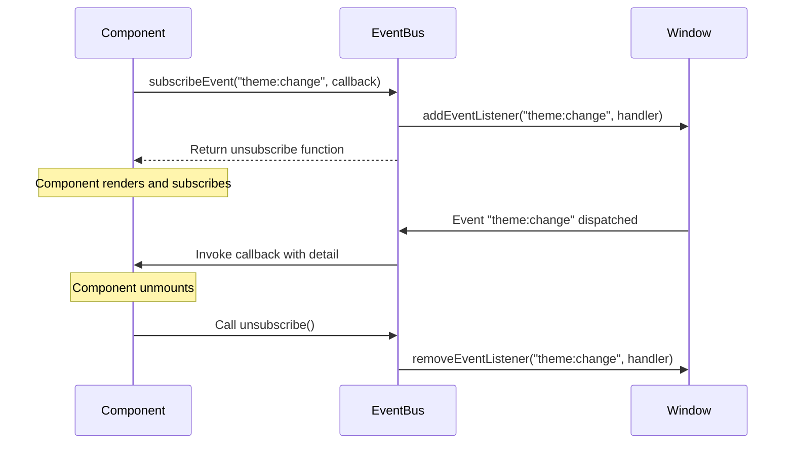
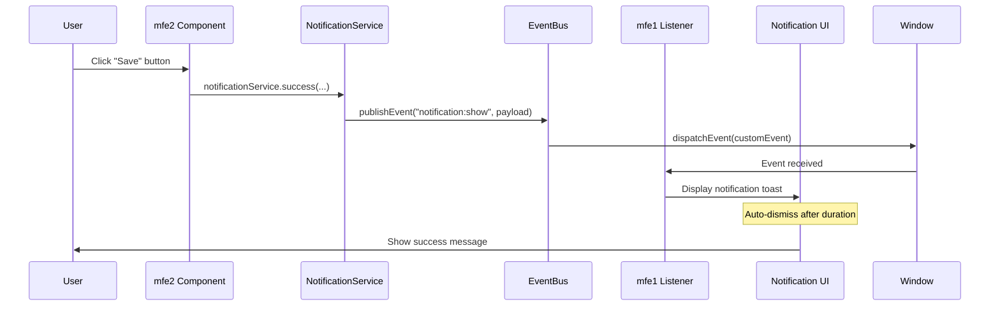

# Communication Patterns

In a Micro Frontend architecture, **independent applications need to communicate without tight coupling**. This project uses a **type-safe Event Bus** pattern implemented in the `@repo/core` package to enable cross-application messaging.

## Event Bus Architecture

The Event Bus provides a **publish-subscribe** pattern using the browser's native `CustomEvent` API with TypeScript type safety.



## Type-Safe Events

All events are defined in `AppEventMap` interface, ensuring **compile-time safety** for event names and payloads.

```typescript title="packages/core/src/event-bus/index.ts"
export interface AppEventMap {
  "notification:show": NotificationPayload;
  "theme:change": ThemePayload;
  "modal:open": ModalPayload;
  "user:session-expired": { reason: string };
}
```

### Event Payload Types

```typescript title="packages/core/src/types/index.ts"
export interface NotificationPayload {
  type: "success" | "error" | "warning" | "info";
  title: string;
  message: string;
  duration?: number;
}

export interface ThemePayload {
  theme: "light" | "dark" | "system";
}

export interface ModalPayload {
  modalId: string;
  data?: Record<string, unknown>;
}
```

## Publishing Events

Use the `publishEvent` function to emit events from any micro-frontend.

```typescript title="Example: Publishing from mfe1"
import { publishEvent } from "@repo/core";

// Show a success notification
publishEvent("notification:show", {
  type: "success",
  title: "Success!",
  message: "Operation completed successfully",
  duration: 3000,
});

// Change theme
publishEvent("theme:change", {
  theme: "dark",
});

// Open a modal
publishEvent("modal:open", {
  modalId: "user-profile",
  data: { userId: "123" },
});
```

> [!TIP] > **TypeScript IntelliSense** provides autocomplete for event names and validates payload structure at compile-time.

## Subscribing to Events

Use the `subscribeEvent` function to listen for events in any micro-frontend.

```typescript title="Example: Subscribing in mfe2"
import { subscribeEvent } from "@repo/core";
import { useEffect } from "react";

function MyComponent() {
  useEffect(() => {
    // Subscribe to theme changes
    const unsubscribe = subscribeEvent("theme:change", (detail) => {
      console.log("Theme changed to:", detail.theme);
      // Update local state or apply theme
    });

    // Cleanup subscription on unmount
    return unsubscribe;
  }, []);

  return <div>Component content</div>;
}
```

### Subscription Lifecycle



## Notification Service

The `NotificationService` provides a **convenience API** on top of the Event Bus for common notification scenarios.

```typescript title="packages/core/src/services/notification-service.ts"
import { publishEvent } from "../event-bus";
import type { NotificationPayload } from "../types";

export class NotificationService {
  private publish(payload: NotificationPayload) {
    publishEvent("notification:show", payload);
  }

  success(title: string, message: string, duration?: number) {
    this.publish({ type: "success", title, message, duration });
  }

  error(title: string, message: string, duration?: number) {
    this.publish({ type: "error", title, message, duration });
  }

  warning(title: string, message: string, duration?: number) {
    this.publish({ type: "warning", title, message, duration });
  }

  info(title: string, message: string, duration?: number) {
    this.publish({ type: "info", title, message, duration });
  }
}

export const notificationService = new NotificationService();
```

### Usage Example

```typescript title="Using NotificationService"
import { notificationService } from "@repo/core";

// Success notification
notificationService.success(
  "Upload Complete",
  "Your file has been uploaded successfully"
);

// Error notification
notificationService.error(
  "Upload Failed",
  "There was an error uploading your file"
);

// Warning notification
notificationService.warning(
  "Session Expiring",
  "Your session will expire in 5 minutes"
);

// Info notification
notificationService.info("New Feature", "Check out our new dashboard!");
```

## Zustand Store Integration

The project uses **Zustand** for state management, including notification state that's **synchronized across micro-frontends** via the Event Bus.

```typescript title="packages/core/src/hooks/use-notification-store.ts"
import { create } from "zustand";
import type { NotificationPayload } from "../types";

interface NotificationStore {
  notifications: NotificationPayload[];
  addNotification: (notification: NotificationPayload) => void;
  removeNotification: (index: number) => void;
}

export const useNotificationStore = create<NotificationStore>((set) => ({
  notifications: [],
  addNotification: (notification) =>
    set((state) => ({
      notifications: [...state.notifications, notification],
    })),
  removeNotification: (index) =>
    set((state) => ({
      notifications: state.notifications.filter((_, i) => i !== index),
    })),
}));
```

### Connecting Event Bus to Zustand

```typescript title="Example: Sync Event Bus with Zustand Store"
import { subscribeEvent } from "@repo/core";
import { useNotificationStore } from "@repo/core";
import { useEffect } from "react";

function NotificationListener() {
  const addNotification = useNotificationStore((s) => s.addNotification);

  useEffect(() => {
    const unsubscribe = subscribeEvent("notification:show", (detail) => {
      addNotification(detail);
    });

    return unsubscribe;
  }, [addNotification]);

  return null;
}
```

## Event Debugging

The project includes an **EventDebugger** component in `@repo/ui` for development mode debugging.

> [!NOTE]
> The EventDebugger component provides a floating panel to inspect all events in real-time during development.

### Features

✅ **Real-time Event Log** - See all events as they're published  
✅ **Event Details** - Inspect event names, origins, timestamps, and payloads  
✅ **JSON Viewer** - Collapsible JSON view for complex payloads  
✅ **Search & Filter** - Find specific events quickly  
✅ **Color-Coded** - Different colors for different event types

### Usage

```typescript title="apps/mfe1/src/App.tsx"
import { EventDebugger } from "@repo/ui";

function App() {
  return (
    <>
      {/* Your app content */}

      {/* Event Debugger - Only in development */}
      {import.meta.env.DEV && <EventDebugger />}
    </>
  );
}
```

## Communication Patterns Summary

| Pattern                  | Use Case                            | Example                                    |
| ------------------------ | ----------------------------------- | ------------------------------------------ |
| **Direct Event Bus**     | Custom events, fine-grained control | `publishEvent("notification:show", {...})` |
| **Notification Service** | Common notification scenarios       | `notificationService.success(...)`         |
| **Zustand Store**        | Shared state across MFEs            | `useNotificationStore()`                   |

## Best Practices

> [!IMPORTANT]
> Follow these best practices for effective cross-MFE communication:

### ✅ Do's

- **Define events in `AppEventMap`** - Ensures type safety
- **Use descriptive event names** - Follow the pattern `domain:action`
- **Clean up subscriptions** - Always return the unsubscribe function in `useEffect`
- **Keep payloads serializable** - Avoid functions or complex objects
- **Document custom events** - Add comments for event purpose and payload structure

### ❌ Don'ts

- **Don't share state via globals** - Use the Event Bus instead
- **Don't publish events in loops** - Can cause performance issues
- **Don't rely on event order** - Events are asynchronous
- **Don't put large data in events** - Use references or IDs instead

## Event Flow Example

Here's a complete example of how a notification flows through the system:



## Next Steps

Continue to [Tech Stack](../technical/stack.md) to learn about the technologies powering this architecture.
