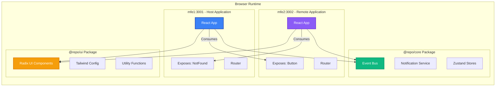
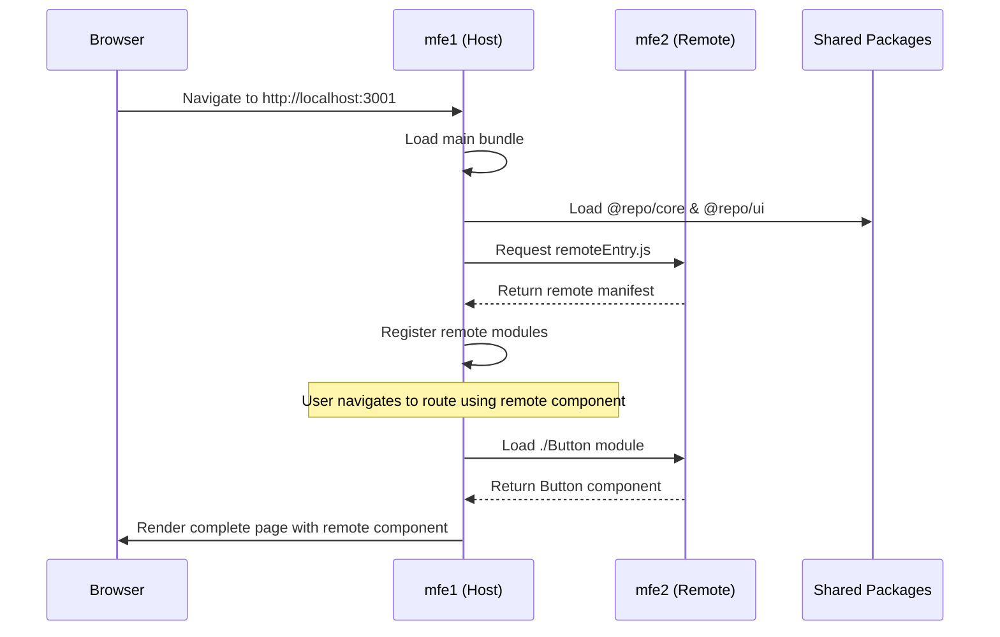
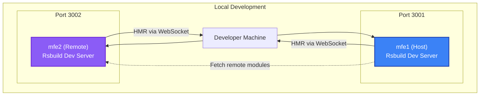
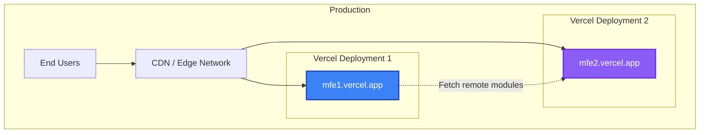

# System Overview

This page provides a comprehensive overview of the Micro Frontend architecture, focusing on how **Module Federation** orchestrates the interaction between the host application (`mfe1`) and remote application (`mfe2`).

## High-Level Architecture

The architecture follows a **bidirectional Module Federation** pattern where both applications can expose and consume components from each other.



## Host Application (mfe1)

> [!IMPORTANT]
> The host application acts as the **container** that orchestrates the overall user experience and dynamically loads remote modules at runtime.

### Key Responsibilities

- **Application Shell**: Provides the main layout, navigation, and routing infrastructure
- **Remote Integration**: Dynamically loads and renders components from remote applications
- **Shared Context**: Manages global state and provides context to remote applications
- **Entry Point**: Serves as the primary entry point for end users

### Exposes

| Export Name  | Component Path                               | Purpose                  |
| ------------ | -------------------------------------------- | ------------------------ |
| `./NotFound` | `./src/components/common/templates/NotFound` | 404 error page component |

### Consumes

- **Remote components** from `mfe2` (configured via `VITE_MFE2_BASE_URL`)

### Configuration

```typescript title="apps/mfe1/rsbuild.config.ts"
{
  name: "host",
  remotes: {
    remote: "remote@http://localhost:3002/remoteEntry.js"
  },
  exposes: {
    "./NotFound": "./src/components/common/templates/NotFound"
  }
}
```

## Remote Application (mfe2)

> [!TIP]
> Remote applications are **independently deployable** units that can be consumed by the host or other remote applications.

### Key Responsibilities

- **Feature Modules**: Encapsulates specific features or business domains
- **Independent Deployment**: Can be deployed without affecting the host
- **Component Exposure**: Exposes reusable components for other applications
- **Standalone Mode**: Can run independently for development and testing

### Exposes

| Export Name | Component Path                | Purpose                     |
| ----------- | ----------------------------- | --------------------------- |
| `./Button`  | `./src/components/export-app` | Exportable button component |

### Consumes

- **Host components** from `mfe1` (configured via `VITE_MFE1_BASE_URL`)

### Configuration

```typescript title="apps/mfe2/rsbuild.config.ts"
{
  name: "remote",
  exposes: {
    "./Button": "./src/components/export-app"
  },
  filename: "remoteEntry.js"
}
```

## Runtime Behavior

### Initial Load Sequence



### Dynamic Module Loading

1. **Host Initialization**: mfe1 loads and initializes its core bundles
2. **Remote Registration**: mfe1 fetches `remoteEntry.js` from mfe2
3. **Lazy Loading**: Remote components are loaded on-demand when needed
4. **Shared Dependencies**: React and React-DOM are loaded once (singleton mode)
5. **Rendering**: Remote components render seamlessly within the host application

## Shared Dependencies Strategy

Both applications share critical dependencies to avoid duplicate code and ensure compatibility.

```typescript title="Shared Configuration"
{
  shared: {
    react: {
      singleton: true,        // Only one instance across all MFEs
      requiredVersion: false  // Accept any version
    },
    'react-dom': {
      singleton: true,
      requiredVersion: false
    }
  }
}
```

> [!WARNING] > **Singleton Mode** ensures only one instance of React is loaded. Without this, you'll encounter the infamous "Invalid Hook Call" error.

### Dependency Resolution Rules

| Scenario               | Behavior                                        |
| ---------------------- | ----------------------------------------------- |
| **Same version**       | Share the dependency                            |
| **Different versions** | Use the version from the host (singleton: true) |
| **Missing dependency** | Load from the consuming application             |

## Deployment Architecture

### Development Environment



### Production Environment

In production, each micro-frontend is deployed to its own URL:



> [!IMPORTANT] > **Environment Variables** are used to configure remote URLs dynamically based on the deployment environment (dev, staging, production).

## Monorepo Structure Benefits

The **pnpm workspace** structure provides several advantages:

✅ **Shared Packages**: `@repo/core` and `@repo/ui` are reused across all applications  
✅ **Dependency Deduplication**: pnpm installs shared dependencies only once  
✅ **Type Safety**: TypeScript types are shared across the monorepo  
✅ **Atomic Changes**: Changes to shared packages are reflected immediately  
✅ **Efficient CI/CD**: Build only what changed

## Next Steps

Continue to [Communication Patterns](./communication.md) to learn how micro-frontends communicate with each other using the Event Bus.
