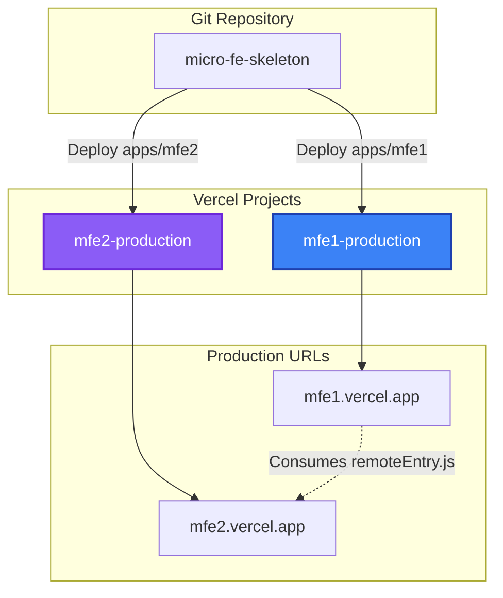

# Deployment Guide

This guide covers building and deploying the Micro Frontend applications to production. We'll focus on **Vercel** deployment, which is the recommended platform for this project.

## Building for Production

### Build All Applications

Build all micro-frontends from the root directory:

```bash
pnpm build
```

This will:

1. Build `@repo/mfe1` → `apps/mfe1/dist`
2. Build `@repo/mfe2` → `apps/mfe2/dist`

### Build Individual Applications

Build a specific micro-frontend:

```bash
# Build mfe1 only
pnpm build:mfe1

# Build mfe2 only
pnpm build:mfe2

# Build shared packages
pnpm build:packages
```

### Build Output

Each application's build output is optimized for production:

```
apps/mfe1/dist/
├── static/
│   ├── css/
│   ├── js/
│   └── assets/
├── index.html
└── remoteEntry.js      # Module Federation manifest

apps/mfe2/dist/
├── static/
│   ├── css/
│   ├── js/
│   └── assets/
├── index.html
└── remoteEntry.js      # Module Federation manifest
```

> [!IMPORTANT]
> The `remoteEntry.js` file is **critical** for Module Federation. It contains the manifest of all exposed modules.

## Environment Variables for Production

Each micro-frontend needs to know the **production URLs** of the other micro-frontends.

### mfe1 (Host) Production Variables

```bash title="Production Environment Variables for mfe1"
VITE_MFE2_BASE_URL=https://mfe2.vercel.app
VITE_MFE2_SCOPE=remote
```

### mfe2 (Remote) Production Variables

```bash title="Production Environment Variables for mfe2"
VITE_MFE1_BASE_URL=https://mfe1.vercel.app
VITE_MFE1_SCOPE=host
```

> [!WARNING] > **Do not hardcode URLs** in the configuration files. Always use environment variables for flexibility across environments (dev, staging, production).

## Deploying to Vercel

Vercel is the recommended deployment platform for this project. Each micro-frontend is deployed as a **separate Vercel project**.

### Prerequisites

1. **Vercel Account** - Sign up at [vercel.com](https://vercel.com)
2. **Vercel CLI** (optional) - Install globally:

```bash
npm install -g vercel
```

### Deployment Strategy



### Step 1: Deploy mfe2 (Remote) First

> [!TIP]
> Always deploy the **remote application first** so the host can reference its production URL.

#### Using Vercel Dashboard

1. Go to [vercel.com/new](https://vercel.com/new)
2. Import your Git repository
3. Configure the project:

| Setting              | Value             |
| -------------------- | ----------------- |
| **Project Name**     | `mfe2-production` |
| **Framework Preset** | Other             |
| **Root Directory**   | `apps/mfe2`       |
| **Build Command**    | `pnpm build`      |
| **Output Directory** | `dist`            |
| **Install Command**  | `pnpm install`    |

4. Add environment variables:

```bash
VITE_MFE1_BASE_URL=https://mfe1.vercel.app  # Will update after mfe1 deployment
VITE_MFE1_SCOPE=host
```

5. Click **Deploy**

#### Using Vercel CLI

```bash
cd apps/mfe2
vercel
```

Follow the prompts:

- **Set up and deploy?** Yes
- **Which scope?** Your team/personal account
- **Link to existing project?** No
- **Project name:** `mfe2-production`
- **Directory:** `./` (you're already in apps/mfe2)
- **Override settings?** Yes
  - **Build Command:** `pnpm build`
  - **Output Directory:** `dist`
  - **Development Command:** `pnpm dev`

After deployment, note the production URL (e.g., `https://mfe2-abc123.vercel.app`).

### Step 2: Deploy mfe1 (Host)

#### Using Vercel Dashboard

1. Create a new Vercel project
2. Configure the project:

| Setting              | Value             |
| -------------------- | ----------------- |
| **Project Name**     | `mfe1-production` |
| **Framework Preset** | Other             |
| **Root Directory**   | `apps/mfe1`       |
| **Build Command**    | `pnpm build`      |
| **Output Directory** | `dist`            |
| **Install Command**  | `pnpm install`    |

3. Add environment variables:

```bash
VITE_MFE2_BASE_URL=https://mfe2-abc123.vercel.app  # Use actual mfe2 URL
VITE_MFE2_SCOPE=remote
```

4. Click **Deploy**

#### Using Vercel CLI

```bash
cd apps/mfe1
vercel
```

Configure with the same settings as mfe2, but use mfe2's production URL in the environment variables.

### Step 3: Update mfe2 Environment Variables

After mfe1 is deployed, update mfe2's environment variables with mfe1's production URL:

1. Go to mfe2 project in Vercel Dashboard
2. Navigate to **Settings** → **Environment Variables**
3. Update `VITE_MFE1_BASE_URL` to mfe1's production URL
4. Click **Save**
5. Redeploy mfe2:

```bash
vercel --prod
```

## Deployment Configuration Files

### Root Directory Configuration

For Vercel to work correctly with the monorepo, add a `vercel.json` in the root:

```json title="vercel.json (Root)"
{
  "version": 2,
  "buildCommand": "pnpm install"
}
```

### mfe1 Vercel Configuration

```json title="apps/mfe1/vercel.json"
{
  "buildCommand": "cd ../.. && pnpm install && cd apps/mfe1 && pnpm build",
  "outputDirectory": "dist",
  "installCommand": "echo 'Skipping default install'",
  "framework": null
}
```

### mfe2 Vercel Configuration

```json title="apps/mfe2/vercel.json"
{
  "buildCommand": "cd ../.. && pnpm install && cd apps/mfe2 && pnpm build",
  "outputDirectory": "dist",
  "installCommand": "echo 'Skipping default install'",
  "framework": null
}
```

> [!NOTE]
> The custom `buildCommand` ensures pnpm installs dependencies from the monorepo root, making shared packages available.

## CI/CD with GitHub Actions

Automate deployment using GitHub Actions.

### GitHub Actions Workflow

```yaml title=".github/workflows/deploy.yml"
name: Deploy Micro Frontends

on:
  push:
    branches: [main, develop]
  pull_request:
    branches: [main]

env:
  VERCEL_ORG_ID: ${{ secrets.VERCEL_ORG_ID }}
  VERCEL_PROJECT_ID_MFE1: ${{ secrets.VERCEL_PROJECT_ID_MFE1 }}
  VERCEL_PROJECT_ID_MFE2: ${{ secrets.VERCEL_PROJECT_ID_MFE2 }}

jobs:
  deploy-mfe2:
    runs-on: ubuntu-latest
    steps:
      - uses: actions/checkout@v4

      - name: Setup Node.js
        uses: actions/setup-node@v4
        with:
          node-version: "20"

      - name: Setup pnpm
        uses: pnpm/action-setup@v3
        with:
          version: 9.15.0

      - name: Install Dependencies
        run: pnpm install

      - name: Build mfe2
        run: pnpm --filter @repo/mfe2 build

      - name: Deploy to Vercel
        uses: amondnet/vercel-action@v25
        with:
          vercel-token: ${{ secrets.VERCEL_TOKEN }}
          vercel-org-id: ${{ secrets.VERCEL_ORG_ID }}
          vercel-project-id: ${{ secrets.VERCEL_PROJECT_ID_MFE2 }}
          working-directory: ./apps/mfe2
          vercel-args: "--prod"

  deploy-mfe1:
    needs: deploy-mfe2 # Wait for mfe2 to deploy first
    runs-on: ubuntu-latest
    steps:
      - uses: actions/checkout@v4

      - name: Setup Node.js
        uses: actions/setup-node@v4
        with:
          node-version: "20"

      - name: Setup pnpm
        uses: pnpm/action-setup@v3
        with:
          version: 9.15.0

      - name: Install Dependencies
        run: pnpm install

      - name: Build mfe1
        run: pnpm --filter @repo/mfe1 build

      - name: Deploy to Vercel
        uses: amondnet/vercel-action@v25
        with:
          vercel-token: ${{ secrets.VERCEL_TOKEN }}
          vercel-org-id: ${{ secrets.VERCEL_ORG_ID }}
          vercel-project-id: ${{ secrets.VERCEL_PROJECT_ID_MFE1 }}
          working-directory: ./apps/mfe1
          vercel-args: "--prod"
```

### Required GitHub Secrets

Add these secrets to your GitHub repository:

| Secret                   | Description                 | How to Get                                                     |
| ------------------------ | --------------------------- | -------------------------------------------------------------- |
| `VERCEL_TOKEN`           | Vercel API token            | [vercel.com/account/tokens](https://vercel.com/account/tokens) |
| `VERCEL_ORG_ID`          | Your Vercel organization ID | Run `vercel project ls` or check Vercel project settings       |
| `VERCEL_PROJECT_ID_MFE1` | mfe1 project ID             | Vercel project settings                                        |
| `VERCEL_PROJECT_ID_MFE2` | mfe2 project ID             | Vercel project settings                                        |

## Multi-Environment Deployment

Support multiple environments (dev, staging, production):

### Environment-Specific URLs

| Environment     | mfe1 URL                        | mfe2 URL                        |
| --------------- | ------------------------------- | ------------------------------- |
| **Development** | http://localhost:3001           | http://localhost:3002           |
| **Staging**     | https://mfe1-staging.vercel.app | https://mfe2-staging.vercel.app |
| **Production**  | https://mfe1.vercel.app         | https://mfe2.vercel.app         |

### Environment Variable Configuration

Use Vercel's environment-specific variables:

1. Go to **Project Settings** → **Environment Variables**
2. Add variables for each environment:

**Production:**

```bash
VITE_MFE2_BASE_URL=https://mfe2.vercel.app
```

**Preview (Staging):**

```bash
VITE_MFE2_BASE_URL=https://mfe2-staging.vercel.app
```

**Development:**

```bash
VITE_MFE2_BASE_URL=http://localhost:3002
```

## Post-Deployment Verification

### 1. Check Remote Entry Points

Verify that `remoteEntry.js` is accessible:

```bash
# For mfe2
curl https://mfe2.vercel.app/remoteEntry.js

# Should return JavaScript code
```

### 2. Test Module Loading

Visit the host application and open browser DevTools:

1. Go to https://mfe1.vercel.app
2. Open **Network** tab
3. Filter by `remoteEntry.js`
4. Verify it loads successfully (status 200)

### 3. Check Console for Errors

Look for Module Federation errors in the browser console:

```
✅ No errors = successful deployment
❌ "Failed to fetch dynamically imported module" = check URLs
```

## Troubleshooting Deployment Issues

### Issue: `remoteEntry.js` not found (404)

**Symptoms:**

```
GET https://mfe2.vercel.app/remoteEntry.js 404 (Not Found)
```

**Solution:**

1. Verify build command includes Rsbuild:

```bash
pnpm build
```

2. Check `rsbuild.config.ts` has Module Federation configured
3. Ensure `filename: "remoteEntry.js"` is set in remote config

### Issue: CORS errors

**Symptoms:**

```
Access to fetch at 'https://mfe2.vercel.app/remoteEntry.js' from origin 'https://mfe1.vercel.app' has been blocked by CORS
```

**Solution:**

Add CORS headers in `vercel.json`:

```json title="apps/mfe2/vercel.json"
{
  "headers": [
    {
      "source": "/remoteEntry.js",
      "headers": [
        { "key": "Access-Control-Allow-Origin", "value": "*" },
        { "key": "Access-Control-Allow-Methods", "value": "GET" }
      ]
    }
  ]
}
```

### Issue: Environment variables not working

**Solution:**

1. Verify variables are prefixed with `VITE_`
2. Check variable names in Vercel dashboard (Settings → Environment Variables)
3. Redeploy after adding/changing variables

### Issue: Shared dependencies duplicated

**Symptoms:**

- Large bundle sizes
- React "Invalid Hook Call" errors

**Solution:**

Verify `shared` configuration in `rsbuild.config.ts`:

```typescript
shared: {
  react: {
    singleton: true,
    requiredVersion: false
  },
  'react-dom': {
    singleton: true,
    requiredVersion: false
  }
}
```

## Best Practices

> [!IMPORTANT]
> Follow these best practices for successful deployments:

### ✅ Do's

- **Deploy remotes before host** - Ensures host can reference production URLs
- **Use environment variables** - Never hardcode URLs
- **Enable CORS on remotes** - Allows cross-origin module loading
- **Test in staging first** - Verify everything works before production
- **Monitor bundle sizes** - Use Vercel Analytics to track performance
- **Cache `remoteEntry.js` appropriately** - Balance freshness vs performance

### ❌ Don'ts

- **Don't hardcode URLs** - Use environment variables for flexibility
- **Don't skip `remoteEntry.js` verification** - Always check it's accessible
- **Don't deploy both simultaneously** - Can cause race conditions
- **Don't use relative URLs** - Module Federation requires absolute URLs

## Deployment Checklist

Before deploying to production:

- [ ] All environment variables configured correctly
- [ ] `remoteEntry.js` accessible in production
- [ ] CORS headers configured on remote applications
- [ ] Shared dependencies configured as singletons
- [ ] All tests passing
- [ ] Bundle sizes optimized
- [ ] Staging environment tested and verified

## Next Steps

Your Micro Frontend is now deployed! 🎉

- **Monitor Performance** - Use Vercel Analytics
- **Set Up Monitoring** - Add error tracking (Sentry, LogRocket)
- **Optimize Further** - Analyze bundle sizes with Rsbuild analyzer
- **Scale** - Add more micro-frontends as needed

---

**Need help?** Check the [Vercel Deployment Guide](https://github.com/your-username/micro-fe-skeleton/blob/main/VERCEL_DEPLOYMENT_GUIDE.md) for detailed Vercel-specific instructions.
