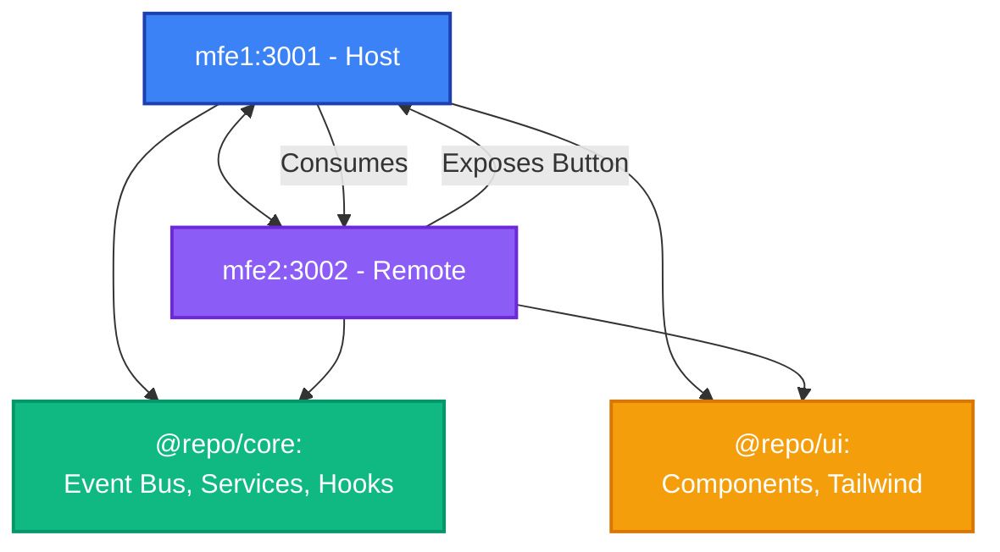

# Introduction

Welcome to the **Micro Frontend Skeleton** documentation! This project demonstrates a production-ready **Micro Frontend (MFE)** architecture using **Module Federation** in a modern **pnpm monorepo** structure.

## What is This Project?

This is a scalable, modular architecture that allows multiple teams to work independently on different parts of a web application. Each micro-frontend is a self-contained application that can be developed, tested, and deployed independently, while seamlessly integrating with other micro-frontends at runtime.

## Key Features

✨ **Module Federation** - Dynamic runtime integration of independent React applications  
📦 **pnpm Monorepo** - Efficient workspace management with shared packages  
⚡ **Rsbuild** - Lightning-fast Rust-based build tool  
🎨 **Shared UI Library** - 13+ Radix UI components with Tailwind CSS  
🔔 **Type-Safe Event Bus** - Cross-application communication without tight coupling  
🔧 **TypeScript** - Full type safety across all applications and packages  
🎯 **Zustand** - Lightweight state management for notifications

## Architecture at a Glance

This monorepo contains:

### Applications

- **mfe1** (`@repo/mfe1`) - Host application on port **3001**
- **mfe2** (`@repo/mfe2`) - Remote application on port **3002**

### Shared Packages

- **@repo/core** - Business logic, Event Bus, services, and hooks
- **@repo/ui** - Reusable UI components and Tailwind configuration



## Why Micro Frontends?

> [!IMPORTANT]
> Micro Frontends enable **independent development, deployment, and scaling** of different parts of your application.

### Benefits

| Benefit                     | Description                                                                 |
| --------------------------- | --------------------------------------------------------------------------- |
| **Independent Deployments** | Deploy updates to one micro-frontend without touching others                |
| **Team Autonomy**           | Different teams can own different micro-frontends with their own tech stack |
| **Technology Flexibility**  | Each micro-frontend can use different versions of libraries                 |
| **Faster Development**      | Smaller codebases are easier to understand and work with                    |
| **Fault Isolation**         | Issues in one micro-frontend don't crash the entire application             |

## Quick Start

:::tip Prerequisites

- **Node.js** 18.x or higher
- **pnpm** 9.x or higher
  :::

```bash
# Install pnpm globally if you haven't
npm install -g pnpm

# Install all dependencies
pnpm install

# Run both applications
pnpm dev
```

Visit:

- **mfe1 (Host):** http://localhost:3001
- **mfe2 (Remote):** http://localhost:3002

## Tech Stack Overview

| Technology            | Version | Purpose                      |
| --------------------- | ------- | ---------------------------- |
| **React**             | 18.3.1  | UI library                   |
| **TypeScript**        | 5.9.3   | Type-safe JavaScript         |
| **pnpm**              | 9.15.0  | Fast package manager         |
| **Rsbuild**           | ~1.6.x  | Rust-based build tool        |
| **Module Federation** | 0.21.6  | Micro-frontend orchestration |
| **Radix UI**          | Various | Accessible UI primitives     |
| **Tailwind CSS**      | 3.4.14  | Utility-first CSS            |
| **Zustand**           | 5.0.9   | State management             |
| **React Router**      | 6.30.2  | Client-side routing          |

## What You'll Learn

By exploring this documentation, you'll learn:

1. **Architecture** - How host and remote applications interact through Module Federation
2. **Communication Patterns** - Type-safe Event Bus for cross-app messaging
3. **Shared Resources** - Managing shared dependencies and UI components
4. **Development Workflow** - Running, building, and deploying micro-frontends
5. **Best Practices** - Code organization, TypeScript patterns, and scalability

## Next Steps

import DocCardList from '@theme/DocCardList';

<DocCardList />

---

**Ready to dive deeper?** Continue to [System Overview](./architecture/system-overview.md) to understand the architecture in detail.
