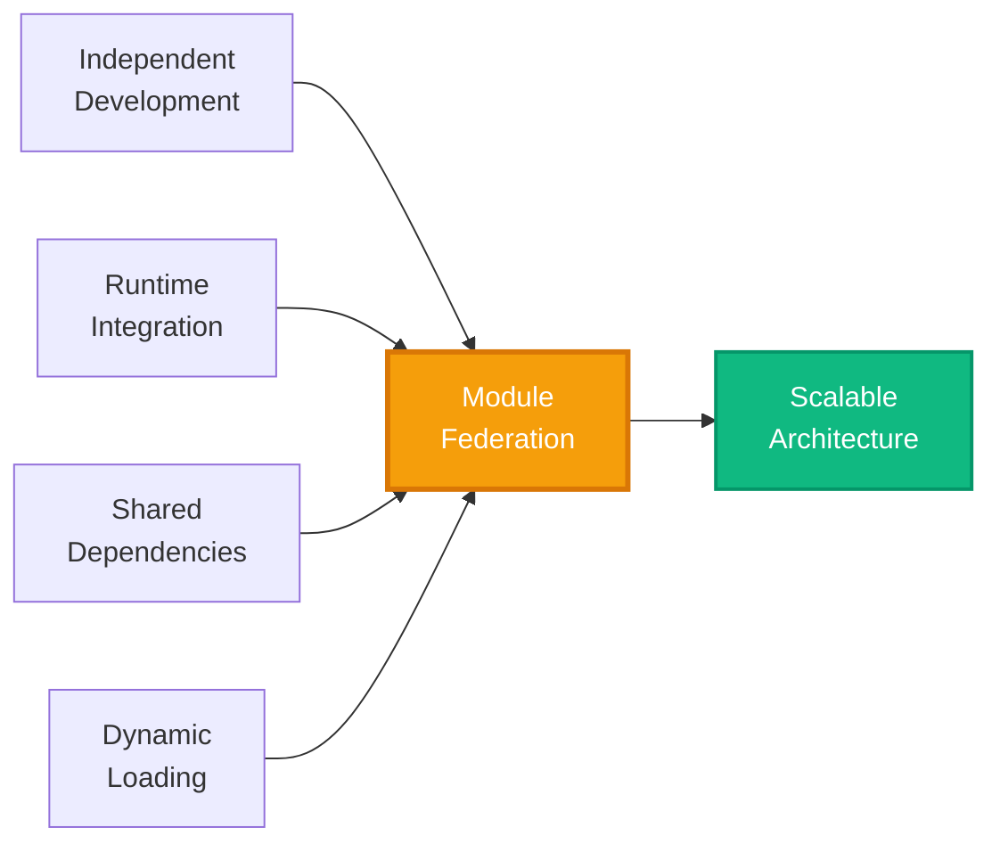

# Technology Stack

This page provides a comprehensive breakdown of all technologies used in the Micro Frontend Skeleton project, including their versions, purposes, and how they work together.

## Core Technologies

The foundation of the entire project is built on these essential technologies:

| Technology     | Version | Purpose              | Why We Use It                                                               |
| -------------- | ------- | -------------------- | --------------------------------------------------------------------------- |
| **React**      | 18.3.1  | UI library           | Industry-standard, component-based UI library with excellent ecosystem      |
| **TypeScript** | 5.9.3   | Type-safe JavaScript | Provides compile-time safety, better IDE support, and self-documenting code |
| **pnpm**       | 9.15.0  | Package manager      | Faster than npm/yarn, efficient disk usage, built-in monorepo support       |
| **Node.js**    | 18.x+   | JavaScript runtime   | Required for build tools and development servers                            |

## Build Tools & Module Federation

The build system leverages cutting-edge tools for performance and Micro Frontend orchestration:

### Rsbuild

**Version:** ~1.6.x  
**Purpose:** Lightning-fast Rust-based build tool

> [!TIP]
> Rsbuild is built on top of Rspack (a Rust implementation of Webpack), providing **10x faster build times** compared to traditional Webpack.

**Key Features:**

- ⚡ Blazing-fast builds with Rust
- 🔌 Plugin ecosystem compatible with Webpack
- 📦 Optimized bundling and code splitting
- 🔥 Hot Module Replacement (HMR)

### Module Federation

**Version:** 0.21.6

Module Federation is the **core technology** enabling micro-frontends in this project.

| Package                             | Purpose                                   |
| ----------------------------------- | ----------------------------------------- |
| `@module-federation/rsbuild-plugin` | Rsbuild integration for Module Federation |
| `@module-federation/enhanced`       | Enhanced Module Federation runtime        |
| `@module-federation/runtime`        | Core runtime for dynamic module loading   |
| `@module-federation/bridge-react`   | React-specific bridge utilities           |
| `@module-federation/retry-plugin`   | Automatic retry for failed remote loads   |

**What Module Federation Enables:**



## UI & Styling

A modern, accessible UI built with best-in-class libraries:

### Radix UI

**Version:** Various (per component)  
**Purpose:** Unstyled, accessible UI primitives

The project uses **13 Radix UI components**:

- `@radix-ui/react-avatar`
- `@radix-ui/react-collapsible`
- `@radix-ui/react-dropdown-menu`
- `@radix-ui/react-icons`
- `@radix-ui/react-scroll-area`
- `@radix-ui/react-separator`
- `@radix-ui/react-dialog` (Sheet)
- `@radix-ui/react-slot`
- `@radix-ui/react-tooltip`
- And more...

> [!IMPORTANT]
> Radix UI provides **WAI-ARIA compliant** components out of the box, ensuring accessibility without extra work.

### Tailwind CSS

**Version:** 3.4.14 (v3) + 4.1.17 (v4 CLI)  
**Purpose:** Utility-first CSS framework

**Key Packages:**

- `tailwindcss` - Core CSS framework
- `@tailwindcss/cli` - Tailwind v4 CLI
- `@tailwindcss/postcss` - PostCSS plugin
- `tailwindcss-animate` - Pre-built animations
- `tw-animate-css` - Additional animation utilities
- `tailwind-merge` - Intelligent class merging

**Styling Utilities:**

```typescript title="packages/ui/src/lib/utils.ts"
import { clsx, type ClassValue } from "clsx";
import { twMerge } from "tailwind-merge";

export function cn(...inputs: ClassValue[]) {
  return twMerge(clsx(inputs));
}
```

### Additional UI Libraries

| Library          | Version  | Purpose                                                         |
| ---------------- | -------- | --------------------------------------------------------------- |
| **CVA**          | 0.7.1    | Component variant API for creating type-safe component variants |
| **clsx**         | 2.1.1    | Utility for constructing className strings conditionally        |
| **Lucide React** | 0.555.0  | Beautiful, consistent icon library                              |
| **Motion**       | 12.23.25 | Powerful animation library (Framer Motion successor)            |

## State Management

### Zustand

**Version:** 5.0.9  
**Purpose:** Lightweight, fast state management

> [!NOTE]
> Zustand is used in `@repo/core` for the notification store, providing **shared state across micro-frontends** with minimal boilerplate.

**Why Zustand?**

- 🪶 **Tiny bundle size** (~1KB)
- ⚡ **No Context Provider needed**
- 🎯 **Simple API** - Easy to learn and use
- 🔄 **Works with Immer** for immutable updates

### Immer

**Version:** 11.0.1  
**Purpose:** Immutable state updates

Used in `mfe1` for complex state updates without mutation.

```typescript
import { produce } from "immer";

const nextState = produce(currentState, (draft) => {
  draft.user.name = "New Name";
  draft.items.push({ id: 1, name: "Item" });
});
```

## Routing

### React Router

**Version:** 6.30.2 (DOM) + 7.10.1 (Core)  
**Purpose:** Client-side routing

Both `mfe1` and `mfe2` use React Router for navigation.

**Key Packages:**

- `react-router` - Core routing logic
- `react-router-dom` - DOM bindings for web apps

**Module Federation + React Router:**

```typescript
// Rsbuild config
{
  bridge: {
    enableBridgeRouter: true; // Enables router integration
  }
}
```

This enables **seamless navigation** between host and remote routes.

## Theme Management

### next-themes

**Version:** 0.4.6  
**Purpose:** Dark mode / theme switching

Used in `mfe1` to provide system-aware theme switching with persistence.

**Features:**

- 🌓 Light/Dark/System themes
- 💾 LocalStorage persistence
- 🎨 CSS variable support
- ⚡ No flash on load

## Development Tools

### Code Quality

| Tool                            | Version | Purpose                            |
| ------------------------------- | ------- | ---------------------------------- |
| **ESLint**                      | 9.39.1  | JavaScript/TypeScript linting      |
| **TypeScript ESLint**           | 8.48.1  | TypeScript-specific linting rules  |
| **eslint-plugin-react-hooks**   | 7.0.1   | Enforces React Hooks rules         |
| **eslint-plugin-react-refresh** | 0.4.24  | Ensures Fast Refresh compatibility |
| **Prettier**                    | 3.7.4   | Code formatting                    |

### Build & Type Checking

| Tool                    | Purpose                            |
| ----------------------- | ---------------------------------- |
| **TypeScript Compiler** | Type checking (`tsc --noEmit`)     |
| **PostCSS**             | CSS processing                     |
| **Autoprefixer**        | Adds vendor prefixes automatically |
| **jiti**                | TypeScript config loader           |

## Shared Package Dependencies

### @repo/core

```json title="packages/core/package.json"
{
  "dependencies": {
    "react": "^18.3.1", // Peer dependency
    "zustand": "5.0.9" // Notification store
  }
}
```

**Exports:**

- `event-bus` - Type-safe Event Bus
- `hooks` - `useNotificationStore`, `useEventSpy`
- `services` - `NotificationService`
- `types` - Shared TypeScript interfaces

### @repo/ui

```json title="packages/ui/package.json"
{
  "dependencies": {
    "class-variance-authority": "^0.7.1",
    "clsx": "^2.1.1",
    "lucide-react": "^0.555.0",
    "motion": "^12.23.25",
    "react-json-view": "^1.21.3",
    "tailwind-merge": "^3.4.0"
    // ... Radix UI packages
  }
}
```

**Exports:**

- 13 UI components (Button, Card, Sheet, etc.)
- `cn()` utility function
- `useIsMobile` hook
- Tailwind configuration
- EventDebugger DevTool

## Dependency Management Strategy

### Singleton Mode

Critical dependencies like React are configured as **singletons** to prevent duplication:

```typescript
{
  shared: {
    react: {
      singleton: true,        // Only one instance
      requiredVersion: false  // Accept any version
    }
  }
}
```

### Workspace Protocol

The monorepo uses `workspace:*` for local package dependencies:

```json
{
  "dependencies": {
    "@repo/core": "workspace:*",
    "@repo/ui": "workspace:*"
  }
}
```

This ensures apps **always use the latest local version** of shared packages.

## Version Summary

### Quick Reference Table

| Category    | Technology        | Version         |
| ----------- | ----------------- | --------------- |
| **Core**    | React             | 18.3.1          |
|             | TypeScript        | 5.9.3           |
|             | pnpm              | 9.15.0          |
| **Build**   | Rsbuild           | 1.6.x           |
|             | Module Federation | 0.21.6          |
| **Styling** | Tailwind CSS      | 3.4.14 / 4.1.17 |
|             | Motion            | 12.23.25        |
| **State**   | Zustand           | 5.0.9           |
|             | Immer             | 11.0.1          |
| **Routing** | React Router      | 6.30.2          |
| **Quality** | ESLint            | 9.39.1          |
|             | Prettier          | 3.7.4           |

## Next Steps

Continue to [Project Structure](./project-structure.md) to understand how the codebase is organized.
